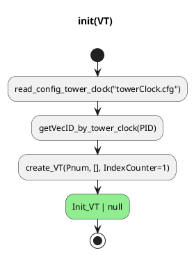
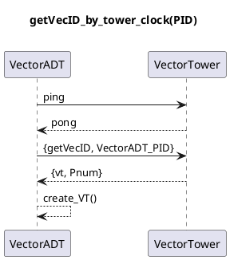
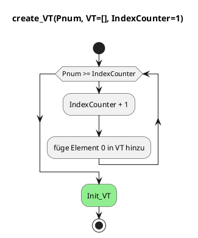

```plantuml

@startuml
title **init(VT)** \n

start

:read_config_tower_clock("towerClock.cfg");
:getVecID_by_tower_clock(PID);
:create_VT(Pnum, [], IndexCounter=1);
#lightgreen:Init_VT | null;

stop


@enduml

```

```plantuml

@startuml
title **getVecID_by_tower_clock(PID)** \n

VectorADT -> VectorTower : ping
VectorADT <-- VectorTower : pong
VectorADT -> VectorTower : {getVecID, VectorADT_PID}
VectorADT <-- VectorTower : {vt, Pnum}
VectorADT --> VectorADT : create_VT()

@enduml

```

```plantuml

@startuml
title **create_VT(Pnum, VT=[], IndexCounter=1)** \n

start
while (Pnum >= IndexCounter)
  :IndexCounter + 1;
  :füge Element 0 in VT hinzu;
endwhile
#lightgreen:Init_VT;
stop


@enduml

```

