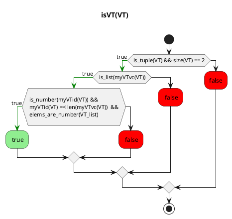

```plantuml 

@startuml
title **isVT(VT)** \n

start
if (is_tuple(VT) && size(VT) == 2) then (true)
    -[#green]->
    if (is_list(myVTvc(VT))) then (true)
        -[#green]->
        if (\n is_number(myVTid(VT)) && \n myVTid(VT) =< len(myVTvc(VT))  && \n elems_are_number(VT_list) \n) then (true)
            -[#green]->
            #lightgreen: true;
        else 
            #red: false;
        endif
    else 
        #red: false;
    endif
else 
    #red:false;
endif
stop

@enduml

```