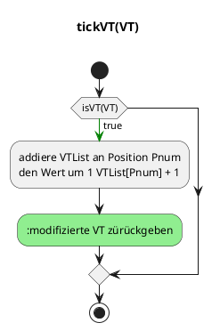

```plantuml

@startuml
title **tickVT(VT)** \n

start

if (isVT(VT)) then (true)
    -[#green]->
    :addiere VTList an Position Pnum 
    den Wert um 1 VTList[Pnum] + 1;
    #lightgreen::modifizierte VT zürückgeben;
endif

stop
@enduml

```