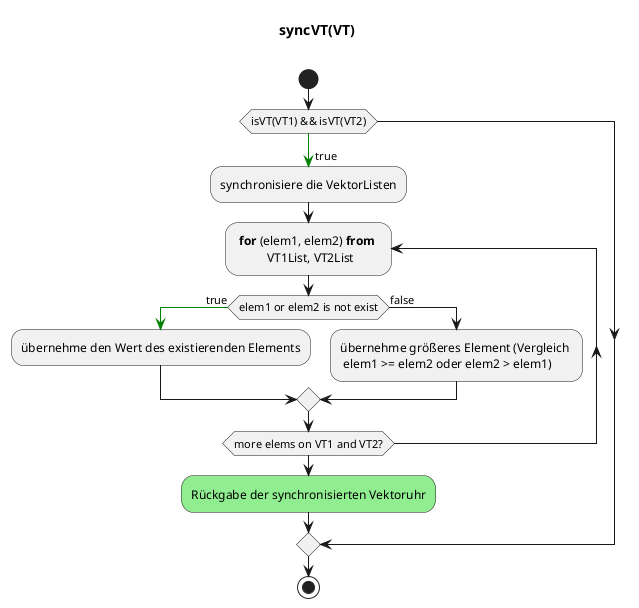

```plantuml

@startuml
title **syncVT(VT)** \n

start

if (isVT(VT1) && isVT(VT2)) then (\n true)
    -[#green]->
    :synchronisiere die VektorListen;
        repeat : **for** (elem1, elem2) **from**  \n\t  VT1List, VT2List;
            if (elem1 or elem2 is not exist) then (true)
                -[#green]->
                :übernehme den Wert des existierenden Elements;
            else (false)
                :übernehme größeres Element (Vergleich \n elem1 >= elem2 oder elem2 > elem1);
            endif
        repeat while (more elems on VT1 and VT2?)
    #lightgreen:Rückgabe der synchronisierten Vektoruhr;
endif

stop
@enduml

```