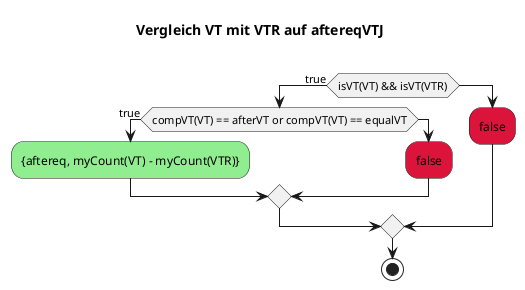
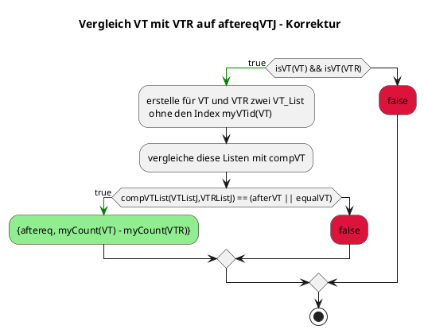

```plantuml

@startuml
title **Vergleich VT mit VTR auf aftereqVTJ** \n


if (isVT(VT) && isVT(VTR)) then (true)
    if (compVT(VT) == afterVT or compVT(VT) == equalVT) then (true)
        #lightgreen:{aftereq, myCount(VT) - myCount(VTR)};
    else 
        #crimson:false;
    endif
else 
    #crimson:false;
endif
    

stop

@enduml

```

```plantuml

@startuml
title **Vergleich VT mit VTR auf aftereqVTJ - Korrektur** \n


if (isVT(VT) && isVT(VTR)) then (true)
    -[#green]->
    :erstelle für VT und VTR zwei VT_List \n ohne den Index myVTid(VT);
    :vergleiche diese Listen mit compVT;
    if (compVTList(VTListJ,VTRListJ) == (afterVT || equalVT)) then (true)
        -[#green]->
        #lightgreen:{aftereq, myCount(VT) - myCount(VTR)};
    else 
        #crimson:false;
    endif
else 
    #crimson:false;
endif
    

stop

@enduml

```