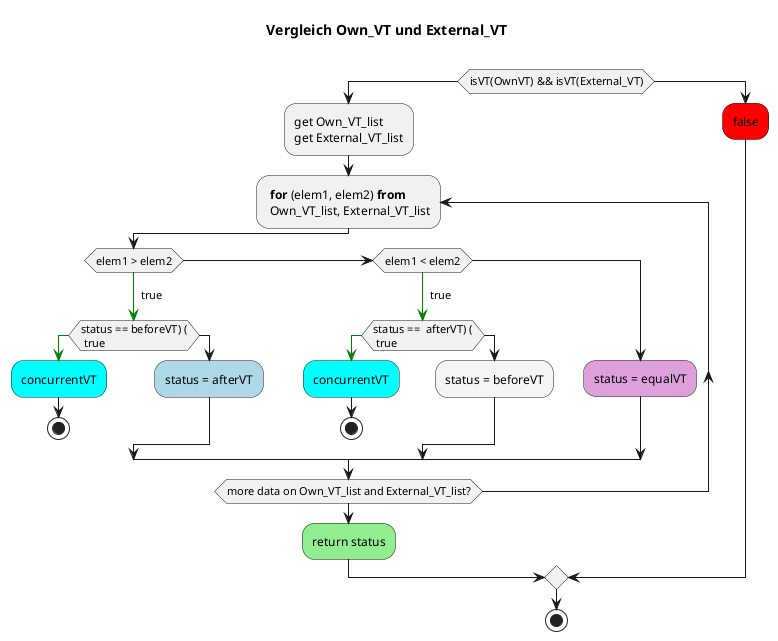

```plantuml

@startuml
title **Vergleich Own_VT und External_VT** \n


if (isVT(OwnVT) && isVT(External_VT)) then
    :get Own_VT_list
    get External_VT_list;
    repeat : **for** (elem1, elem2) **from**  \n Own_VT_list, External_VT_list;
        if (elem1 > elem2) then (\n true)
        -[#green]->
            if (status == beforeVT) (\n true)
                -[#green]->
                #cyan:concurrentVT;
                stop
            else 
            #lightblue:status = afterVT;
            endif 
        else if (elem1 < elem2) then  (\n true)
        -[#green]->
            if (status ==  afterVT) (\n true)
                -[#green]->
                #cyan:concurrentVT;
                stop
            else             
            #whitesmoke:status = beforeVT;
            endif
        else
            #plum:status = equalVT;
        endif
    repeat while (more data on Own_VT_list and External_VT_list?)
    #lightgreen:return status;
else 
    #red:false;
endif 

stop

@enduml

```