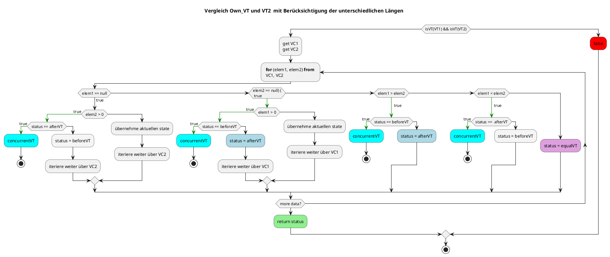

```plantuml

@startuml
title **Vergleich Own_VT und VT2  mit Berücksichtigung der unterschiedlichen Längen** \n


if (isVT(VT1) && isVT(VT2)) then
    :get VC1
    get VC2;
    repeat : **for** (elem1, elem2) **from**  \n VC1, VC2;
        if (elem1 == null) then (true)
            if (elem2 > 0) then (true)
                -[#green]->
                if (status == afterVT) then (true)
                    -[#green]->
                    #cyan:concurrentVT;
                    stop
                else 
                    #whitesmoke:status = beforeVT;
                    :iteriere weiter über VC2;
                endif
            else
                :übernehme aktuellen state;
                :iteriere weiter über VC2;
            endif
        else if (elem2 == null) (\n true)
            -[#green]->
            if (elem1 > 0) then (\n true)
                -[#green]->
                if (status == beforeVT) then (\n true)
                    -[#green]->
                    #cyan:concurrentVT;
                    stop
                else 
                    #lightblue:status = afterVT;
                    :iteriere weiter über VC1;
                endif
            else
                :übernehme aktuellen state;
                :iteriere weiter über VC1;
            endif
        else if (elem1 > elem2) then (\n true)
            -[#green]->
            if (status == beforeVT) then (\n true)
                -[#green]->
                #cyan:concurrentVT;
                stop
            else 
            #lightblue:status = afterVT;
            endif 
        else if (elem1 < elem2) then (\n true)
            -[#green]->
            if (status ==  afterVT) then (\n true)
                -[#green]->
                #cyan:concurrentVT;
                stop
            else             
            #whitesmoke:status = beforeVT;
            endif
        else
            #plum:status = equalVT;
        endif
    repeat while (more data?)
    #lightgreen:return status;
else 
    #red:false;
endif 

stop

@enduml

```
