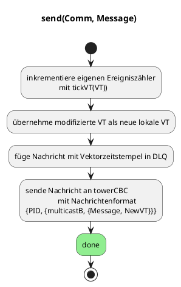

```plantuml

@startuml
title **send(Comm, Message)** \n

start 
:inkrementiere eigenen Ereigniszähler 
\t\t mit tickVT(VT));
:übernehme modifizierte VT als neue lokale VT;
:füge Nachricht mit Vektorzeitstempel in DLQ;
:sende Nachricht an towerCBC
\t\t mit Nachrichtenformat 
{PID, {multicastB, {Message, NewVT}}};
#lightgreen:done;
    
stop

@enduml

```

