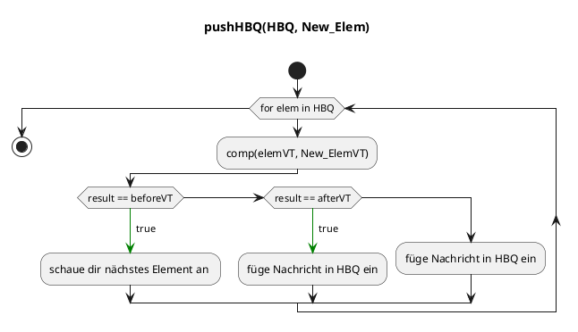

```plantuml

@startuml
title **pushHBQ(HBQ, New_Elem)** \n

start 
while (for elem in HBQ)
    :comp(elemVT, New_ElemVT);
    if (result == beforeVT) then (\n true)
        -[#green]->
        :schaue dir nächstes Element an ;
    else if (result == afterVT) then (\n true)
        -[#green]->
        :füge Nachricht in HBQ ein;
    else
        :füge Nachricht in HBQ ein;
   endif
endwhile

stop

@enduml

```