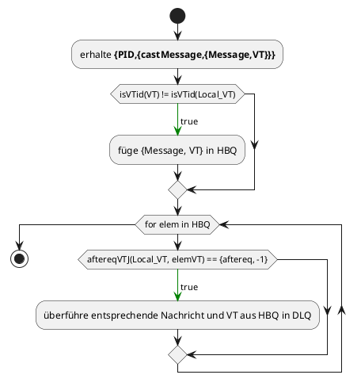

```plantuml

@startuml
start 

:erhalte **{PID,{castMessage,{Message,VT}}}**;
if (isVTid(VT) != isVTid(Local_VT)) then (\ntrue\n) 
-[#green]->
:füge {Message, VT} in HBQ;
endif
while (for elem in HBQ)
    if (aftereqVTJ(Local_VT, elemVT) == {aftereq, -1}) then (\ntrue\n) 
    -[#green]-> 
    :überführe entsprechende Nachricht und VT aus HBQ in DLQ;
    endif
endwhile

stop

@enduml

```

