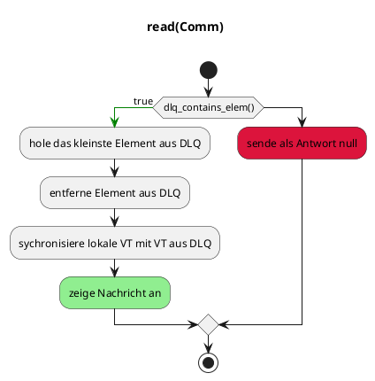

```plantuml

@startuml
title **read(Comm)** \n

start 
if (dlq_contains_elem()) then (true)
    -[#green]->
    :hole das kleinste Element aus DLQ;
    :entferne Element aus DLQ;
    :sychronisiere lokale VT mit VT aus DLQ;
    #lightgreen:zeige Nachricht an;
else 
    #crimson:sende als Antwort null;
endif

    
stop

@enduml

```

