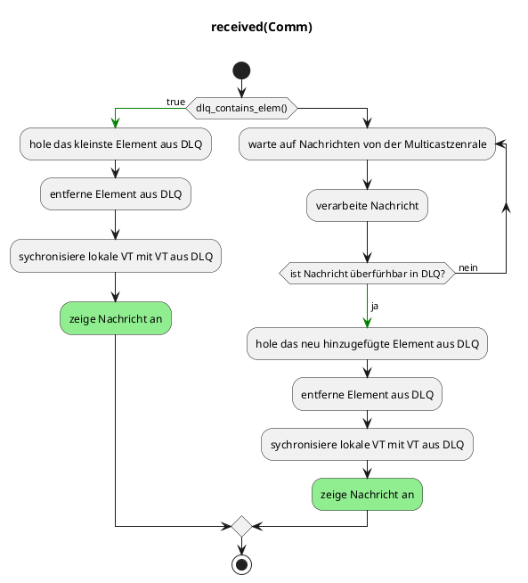

```plantuml

@startuml
title **received(Comm)** \n

start 
if (dlq_contains_elem()) then (true)
    -[#green]->
    :hole das kleinste Element aus DLQ;
    :entferne Element aus DLQ;
    :sychronisiere lokale VT mit VT aus DLQ;
    #lightgreen:zeige Nachricht an;
else 
    repeat :warte auf Nachrichten von der Multicastzenrale;
        :verarbeite Nachricht;

    repeat while (ist Nachricht überfürhbar in DLQ?) is ( nein)
    -[#green]-> ja;
    :hole das neu hinzugefügte Element aus DLQ;
    :entferne Element aus DLQ;
    :sychronisiere lokale VT mit VT aus DLQ;
    #lightgreen:zeige Nachricht an;
endif

    
stop

@enduml

```

