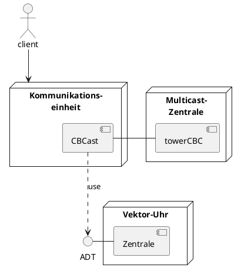

```plantuml 

@startuml 

actor client 
interface ADT

node "Kommunikations-\neinheit" as n1 {
    [CBCast]
}

node "Multicast-\nZentrale" {
  [CBCast] - [towerCBC ]
}

node "Vektor-Uhr" {
  ADT - [Zentrale]
  [CBCast] ..> ADT :use
}


client --> n1


@enduml


```