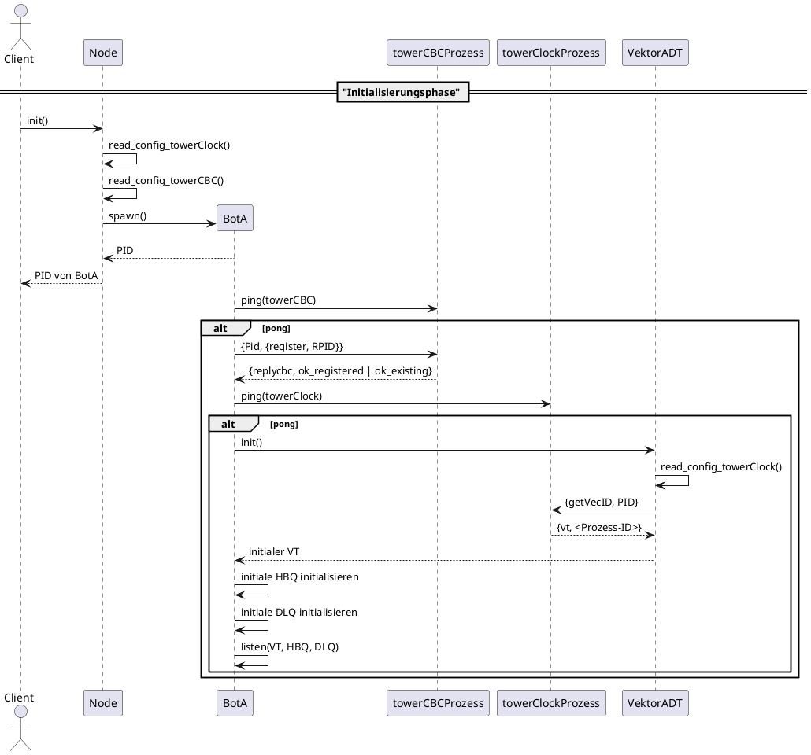

```plantuml

@startuml

== "Initialisierungsphase" == 
actor Client
Client -> Node : init()
Node -> Node : read_config_towerClock()
Node -> Node : read_config_towerCBC()
create BotA
Node -> BotA : spawn()
Node <-- BotA : PID
Client <-- Node : PID von BotA

BotA -> towerCBCProzess : ping(towerCBC)
alt pong 
    BotA -> towerCBCProzess: {Pid, {register, RPID}}
    BotA <-- towerCBCProzess: {replycbc, ok_registered | ok_existing}
    BotA -> towerClockProzess : ping(towerClock)
    alt pong
        BotA -> VektorADT : init()
        VektorADT -> VektorADT : read_config_towerClock()
        VektorADT -> towerClockProzess : {getVecID, PID}
        VektorADT <-- towerClockProzess : {vt, <Prozess-ID>}
        BotA <-- VektorADT: initialer VT
        BotA -> BotA : initiale HBQ initialisieren
        BotA -> BotA : initiale DLQ initialisieren
        BotA -> BotA : listen(VT, HBQ, DLQ)
    end
end

@enduml


```