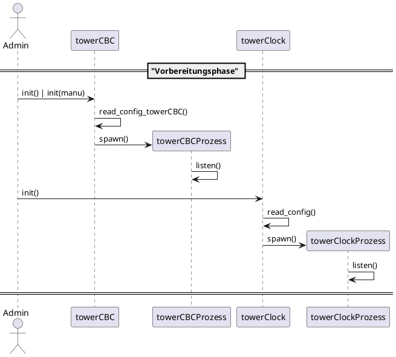

```plantuml

@startuml

== "Vorbereitungsphase" == 

actor Admin
Admin -> towerCBC   : init() | init(manu)
towerCBC -> towerCBC : read_config_towerCBC()
create towerCBCProzess
towerCBC -> towerCBCProzess : spawn()
towerCBCProzess -> towerCBCProzess : listen()
Admin -> towerClock : init()
towerClock -> towerClock : read_config()
create towerClockProzess
towerClock -> towerClockProzess : spawn()

towerClockProzess -> towerClockProzess : listen()
== == 

@enduml


```