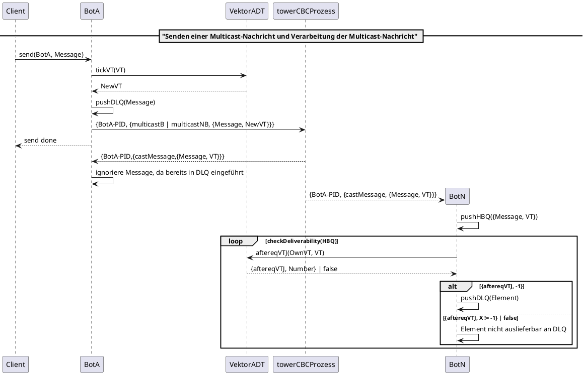

```plantuml

@startuml

== "Senden einer Multicast-Nachricht und Verarbeitung der Multicast-Nachricht" == 

Client -> BotA : send(BotA, Message)
BotA -> VektorADT: tickVT(VT) 
BotA <-- VektorADT: NewVT
BotA -> BotA: pushDLQ(Message)
BotA -> towerCBCProzess : {BotA-PID, {multicastB | multicastNB, {Message, NewVT}}}
Client <-- BotA: send done
BotA <-- towerCBCProzess: {BotA-PID,{castMessage,{Message, VT}}}
BotA -> BotA : ignoriere Message, da bereits in DLQ eingeführt
create BotN 
BotN <-- towerCBCProzess: {BotA-PID, {castMessage, {Message, VT}}}
BotN -> BotN: pushHBQ({Message, VT})
loop checkDeliverability(HBQ)
    BotN -> VektorADT : aftereqVTJ(OwnVT, VT)
    BotN <-- VektorADT : {aftereqVTJ, Number} | false
    alt {aftereqVTJ, -1} 
        BotN -> BotN : pushDLQ(Element)
    else {aftereqVTJ, X != -1} | false
        BotN -> BotN : Element nicht auslieferbar an DLQ
    end 
end


@enduml

```