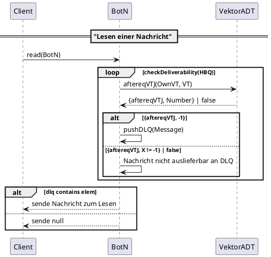

```plantuml

@startuml

== "Lesen einer Nachricht" == 

Client -> BotN : read(BotN)
loop checkDeliverability(HBQ)
    BotN -> VektorADT : aftereqVTJ(OwnVT, VT)
    BotN <-- VektorADT : {aftereqVTJ, Number} | false
    alt {aftereqVTJ, -1} 
        BotN -> BotN : pushDLQ(Message)
    else {aftereqVTJ, X != -1} | false
        BotN -> BotN : Nachricht nicht auslieferbar an DLQ
    end 
end
alt dlq contains elem
    Client <-- BotN : sende Nachricht zum Lesen
else 
    Client <-- BotN : sende null
end


@enduml

```