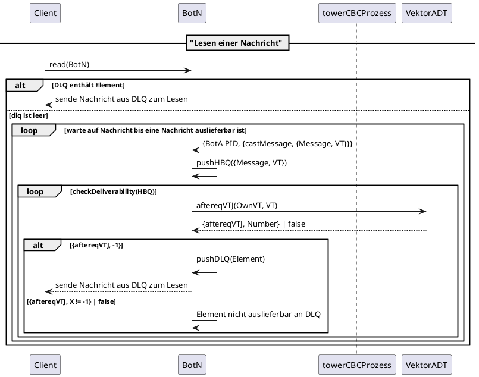

```plantuml

@startuml

== "Lesen einer Nachricht" == 

Client -> BotN : read(BotN)
alt DLQ enthält Element
    Client <-- BotN : sende Nachricht aus DLQ zum Lesen
else dlq ist leer
    loop warte auf Nachricht bis eine Nachricht auslieferbar ist
        BotN <-- towerCBCProzess: {BotA-PID, {castMessage, {Message, VT}}}
        BotN -> BotN: pushHBQ({Message, VT})
            loop checkDeliverability(HBQ)
                BotN -> VektorADT : aftereqVTJ(OwnVT, VT)
                BotN <-- VektorADT : {aftereqVTJ, Number} | false
                alt {aftereqVTJ, -1} 
                    BotN -> BotN : pushDLQ(Element)
                    Client <-- BotN : sende Nachricht aus DLQ zum Lesen

                else {aftereqVTJ, X != -1} | false
                    BotN -> BotN : Element nicht auslieferbar an DLQ
                end 
            end
    end
end


@enduml

```